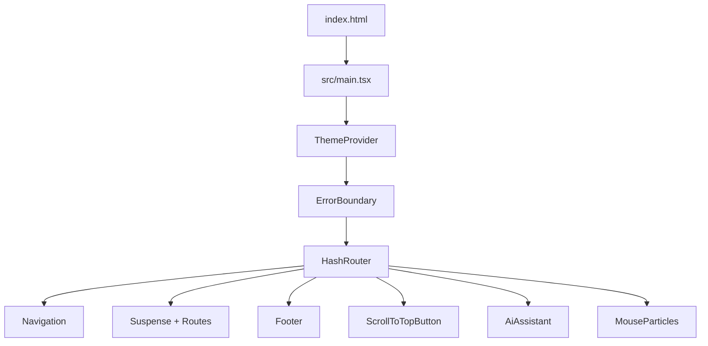
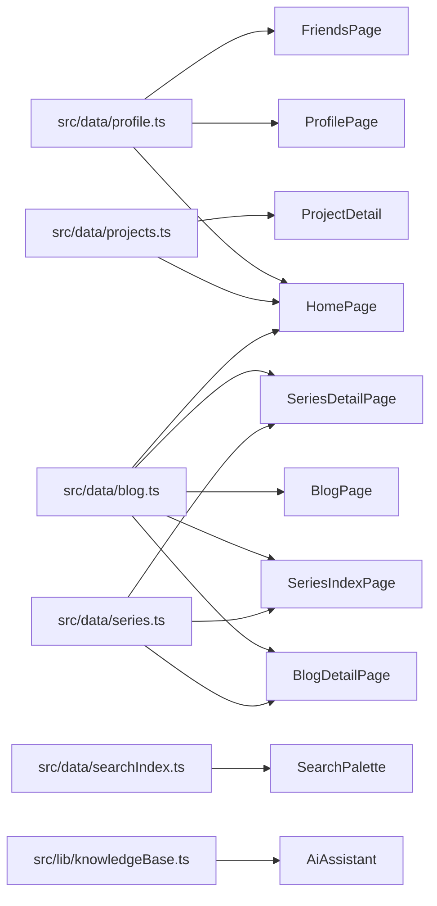

# BobHuang 个人网站代码架构与设计亮点分析

## 1. 网站总体定位

这是一个以个人品牌展示为核心的静态前端网站，技术栈为 React 18、Vite、TypeScript、Tailwind CSS、React Router、Framer Motion 和 i18next。网站部署目标是 GitHub Pages，因此应用使用 `HashRouter` 规避静态托管环境下的刷新 404 问题。

网站内容不只是传统简历页，而是把个人主页、项目集、博客、专题、近况、装备清单、友链、追星专题和 AI 助手组合成一个完整的个人数字空间。整体叙事采用“主城、角色档案、任务中心、游戏攻略”等游戏化语言，让技术内容和个人兴趣形成统一的品牌表达。

核心设计思路是“静态数据驱动 + 组件化页面 + Markdown 内容系统 + 全局体验增强”。大部分业务内容保存在 `src/data` 和 `src/posts` 中，页面负责组织信息结构，组件负责复用交互和视觉表现。

## 2. 技术栈与工程结构

项目使用 Vite 作为构建工具，React 负责 UI，TypeScript 负责类型约束，Tailwind CSS 负责样式系统。`package.json` 中配置了 `dev`、`build`、`lint`、`typecheck`、`check`、`size` 等脚本，说明项目已经具备基础的开发、质量检查和产物体积监控能力。

主要依赖可以分为几类：

- React 生态：`react`、`react-dom`、`react-router-dom`
- 动效与图标：`framer-motion`、`lucide-react`、`react-type-animation`
- 内容渲染：`react-markdown`、`remark-gfm`、`remark-math`、`rehype-*`、`katex`、`mermaid`
- 搜索与国际化：`fuse.js`、`i18next`、`react-i18next`
- 评论与 PWA：`@giscus/react`、`vite-plugin-pwa`

目录分层清晰：

- `src/pages`：页面级路由组件
- `src/components`：可复用 UI、交互、内容渲染和第三方集成组件
- `src/data`：个人信息、项目、奖项、博客、专题、友链等静态数据
- `src/posts`：Markdown 博客正文
- `src/hooks`：页面元信息、主题等 Hook
- `src/contexts`：主题上下文
- `src/lib`：AI 助手知识库和检索逻辑
- `src/utils`：统计与性能日志
- `scripts`：RSS、Sitemap、Bundle Size 等构建辅助脚本

## 3. 应用启动与全局架构

启动链路从 `index.html` 到 `src/main.tsx`，再进入 `src/App.tsx`。`main.tsx` 负责加载全局样式和 i18n，初始化 GoatCounter 统计，并在开发环境输出 Web Vitals 日志。

`App.tsx` 是全局应用壳层，结构如下：

首页 `HomePage` 被同步加载，其余页面都通过 `React.lazy()` 懒加载，并使用 `PageSkeleton` 作为加载占位。这个策略符合个人站点的访问特征：首屏优先展示首页，博客详情、项目详情、专题、Fandom 等页面按需加载。

路由表如下：

- `/`：首页
- `/profile`：角色档案
- `/projects/:id`：项目详情
- `/blog`：博客列表
- `/blog/:id`：博客详情
- `/series`：专题总览
- `/series/:slug`：专题详情
- `/now`：当前动态
- `/uses`：装备清单
- `/friends`：友人帐
- `/fandom`：秘密花园
- `*`：404 页面

`/projects` 没有单独页面，而是通过首页 `#projects` 区块承载，导航里使用锚点滚动处理。这能减少页面数量，也让首页保持“作品入口”的中心地位。

## 4. 构建、PWA 与性能策略

`vite.config.ts` 同时承担构建配置和站点增强职责。配置中接入了 RSS 插件、Sitemap 插件和 PWA 插件。PWA 使用 `autoUpdate`，并通过 Workbox 设置多层缓存：

- HTML 导航请求使用 `NetworkFirst`
- GitHub REST API 使用 `NetworkFirst` 并缓存 30 分钟
- GitHub 贡献热力图 API 缓存 6 小时
- 外部字体使用 `StaleWhileRevalidate`
- 本站静态图片使用 `CacheFirst`

构建分包通过 `manualChunks` 把 React、Framer Motion、Markdown 渲染、KaTeX 单独拆出，减少首屏包体压力。Mermaid 在 `MarkdownRenderer` 里通过动态 `import('mermaid')` 懒加载，避免图表能力影响普通文章首屏加载。

`index.css` 定义了全局基础样式、滚动行为、暗色主题、组件类和无障碍降级。`prefers-reduced-motion` 会显著降低动画时长，体现了对动效敏感用户的照顾。

## 5. 页面实现逻辑

### 5.1 首页 `HomePage.tsx`

首页是整个网站的信息中枢，聚合 `profile`、`techStack`、`projects`、`awards` 和 `blogData`。页面分为 Hero、技能、GitHub 实时数据、项目、博客预览、奖项、更多探索和联系区。

Hero 区使用渐变背景、`HeroBackground`、头像状态徽章和 `react-type-animation` 打字动画。语言切换时通过 `key={t('home.status')}` 让打字动画重新挂载，从而同步中英文内容。

项目区通过 `SmartImage` 展示封面图，缺图时自动降级为渐变色块。点击“在线演示”时会判断链接是外链还是站内路由，点击“项目详情”则跳转到 `/projects/:id`。

奖项区支持按级别筛选，并只展示前 6 项精选荣誉。联系区支持邮箱复制，复制状态通过本地 `emailCopied` 状态做短暂反馈。

亮点：首页承担“第一印象 + 内容入口 + 个人可信度”的复合职责，GitHub 卡片和热力图增强了技术背书，项目和博客预览把用户导向深层内容。

### 5.2 角色档案页 `ProfilePage.tsx`

档案页是简历型页面，使用 Tab 管理内容结构。Tab 包含基本信息、技能专长、获奖经历、实习/学生工作、科研课题、课程成绩和兴趣爱好。

技能 Tab 支持列表视图和雷达图视图。列表视图展示技能等级、星级、说明和证据链接；雷达图从技能数据中抽取前若干项生成 `SkillRadar`。奖项 Tab 支持卡片视图和时间线视图，时间线按年份倒序分组。

页面大量复用 `profile`、`awards`、`skillsDetail`、`courses`、`experiences`、`studentWork`、`research` 等数据文件。它的实现方式偏“数据展示容器”，组件内部定义了 `InfoItem`、`SectionHeading`、`TimelineCard` 等局部小组件，降低了页面模板重复。

亮点：同一份个人数据以多种视图呈现，既适合快速浏览，也适合深入查看履历细节。

### 5.3 项目详情页 `ProjectDetail.tsx`

项目详情页通过 `useParams` 读取项目 `id`，再从 `projectsDetail` 中取对应项目。不存在时会展示友好的缺省页，并列出可用项目 id，方便调试和维护。

页面分为左侧目录和右侧内容。目录项来自 `SECTIONS` 常量，包括项目概述、主要功能、技术栈、挑战、解决方案、成果和经验总结。滚动监听会根据当前滚动位置更新高亮目录项，点击目录项则平滑滚动到对应章节。

项目头图使用 `SmartImage`，有真实图片时可以打开 `Lightbox` 放大查看。页面还通过 `usePageMeta` 设置项目级标题和描述。

亮点：项目详情采用“案例研究”结构，不只是列技术栈，而是把背景、问题、方案、结果和经验组织成完整叙事，适合求职和作品集场景。

### 5.4 博客列表页 `BlogPage.tsx`

博客列表页从 `blogData` 读取文章数据，支持关键词搜索、分类筛选、标签筛选、草稿显示开关和 RSS 入口。

搜索逻辑使用 `useMemo` 对标题、摘要和标签做本地匹配。分类计数和标签集合也通过 `useMemo` 从文章数据中计算，避免重复计算。筛选条件为空时展示全部非草稿文章；打开草稿开关后草稿也会出现在列表中。

亮点：博客列表没有依赖后端，完全依靠 Vite 的 Markdown 静态导入和前端筛选实现，适合 GitHub Pages 这类静态托管环境。

### 5.5 博客详情页 `BlogDetailPage.tsx`

博客详情页通过文章 id 调用 `getPost`。存在文章时展示标题、摘要、分类、标签、发布时间、阅读时间、作者、Markdown 正文、目录、阅读进度、评论、相关文章和专题上下篇导航。

专题匹配基于 `series.matchTags` 和文章 tags 的交集。相关文章基于同分类或共享标签生成。同专题上下篇根据匹配专题下的文章顺序计算。

正文由 `MarkdownRenderer` 渲染，支持 GFM、数学公式、代码高亮、Mermaid 图表和代码组。评论通过 `Comments` 接入 Giscus。

亮点：博客详情把 Markdown 内容系统、专题系统、目录、阅读进度和评论串成完整阅读体验，接近独立博客系统。

### 5.6 专题总览页 `SeriesIndexPage.tsx`

专题总览页不手工维护文章列表，而是遍历 `series`，再用 `series.matchTags` 自动匹配 `blogData`。每个专题卡片会计算文章数量、最新文章和总阅读时间。

卡片支持封面图或渐变色块两种表现。没有文章时会展示“暂无文章”的提示，方便后续逐步补全专题内容。

亮点：专题是派生数据，不需要重复维护。只要博客文章带上对应标签，就能自动进入专题。

### 5.7 专题详情页 `SeriesDetailPage.tsx`

专题详情页通过 `slug` 查找专题定义，再筛选匹配文章。页面头部使用专题配置中的渐变色、图标、英文名和封面图，正文区域展示文章列表。

不存在的专题会返回友好空状态。没有文章的专题会提示应给博客添加对应标签，并提供返回博客列表的入口。

亮点：专题详情把“标签聚合”包装成更具产品感的阅读路径，提升了博客内容的可发现性。

### 5.8 当前动态页 `NowPage.tsx`

`NowPage` 参考 nownownow.com 的内容形态，从 `nowLastUpdated` 和 `nowSections` 渲染当前正在写的代码、正在读的内容、正在做的事和生活状态。

页面结构很轻，重点是保持更新成本低。内容完全由 `src/data/now.ts` 驱动，页面只负责布局、动效和相关链接。

亮点：它让网站从“静态简历”变成“持续更新的个人状态页”，增强真实感。

### 5.9 装备清单页 `UsesPage.tsx`

`UsesPage` 参考 uses.tech，把硬件、开发工具、命令行、技术栈偏好等内容整理成结构化清单。数据来自 `usesCategories`，标题支持 i18n fallback。

页面使用定义列表 `dl/dt/dd` 展示工具名和值，语义清晰，维护成本低。

亮点：这类页面能快速传达开发者的工作流和技术偏好，也能补充简历之外的生活化信息。

### 5.10 友人帐页 `FriendsPage.tsx`

友人帐页展示 `friends` 列表，并提供本站友链卡片 `myLinkCard`。用户可以一键复制友链信息，也可以通过邮件或 GitHub Issue 发起友链申请。

复制逻辑使用 `navigator.clipboard`，复制成功后短暂显示状态。邮件申请链接会自动填充标题和正文模板。

亮点：页面不仅展示友链，还把交换友链的流程产品化，减少沟通成本。

### 5.11 秘密花园页 `FandomPage.tsx`

Fandom 页是相对私密的兴趣专题页。它读取 `fandomConfig` 判断是否需要密码，如果配置了密码，则使用本地表单校验，并把授权状态保存在 `sessionStorage`。代码中也明确说明这不是加密方案，而是本地访问门禁。

授权后页面展示追星相关内容，包括偶像、演唱会、应援记录、收藏和感悟。页面支持真实姓名显示/隐藏，Tab 使用 Framer Motion 的 `layoutId` 实现平滑切换。统计胶囊会根据数据计算追星年数、现场次数、应援次数和收藏数量。

亮点：这个页面把个人兴趣做成了完整的信息专题，同时通过本地密码和姓名显示开关提供轻量隐私控制。

### 5.12 404 页面 `NotFoundPage.tsx`

404 页面不是简单的错误提示，而是内置了一个 Canvas 弹球小游戏。游戏状态保存在 `useRef` 中，React 状态只同步阶段和分数，避免每帧重渲染。

游戏支持键盘、鼠标和触摸操作，使用 `requestAnimationFrame` 绘制背景、球、挡板和分数。组件卸载时会取消动画帧并移除事件监听。

亮点：404 页面通过小游戏把错误场景转化为彩蛋体验，增强网站记忆点。

## 6. 组件模块分析

### 6.1 全局布局与导航组件

`Navigation.tsx` 负责桌面端导航、移动端菜单、“更多”下拉、滚动隐藏、锚点跳转、主题切换、语言切换和全局搜索入口。它监听滚动方向来决定导航栏是否隐藏，并在点击外部、按 Esc、路由变化时自动关闭菜单。

`Footer.tsx` 提供站点底部导航、联系方式和构建说明，是全局壳层的一部分。

`ScrollToTopButton.tsx` 提供回到顶部入口，适合博客详情和长页面。

`SectionReveal.tsx` 封装滚动进入视口的 Framer Motion 动画，首页和多个页面使用它保持动效一致。

`HeroBackground.tsx` 负责首页 Hero 的背景增强，包括网格、光斑、极光或视差类装饰效果。

`Skeleton.tsx` 提供页面和卡片骨架屏，配合路由懒加载改善切换体验。

### 6.2 主题、语言与搜索组件

`ThemeToggle.tsx` 控制明暗主题切换，并结合 View Transition 实现圆形擦除动画。主题值由 `ThemeContext` 统一管理，并持久化到 localStorage。

`LanguageToggle.tsx` 切换 i18next 语言。`main.tsx` 监听语言变化并同步 `<html lang>`，有利于可访问性和搜索引擎理解。

`SearchTrigger.tsx` 是全局搜索入口，`SearchPalette.tsx` 是命令面板式搜索弹窗。搜索语料来自 `searchCorpus`，覆盖静态页面、项目、博客、奖项和技能。Fuse.js 负责模糊匹配，结果通过 `href` 跳转到 HashRouter 地址。

### 6.3 Markdown 与阅读体验组件

`MarkdownRenderer.tsx` 是博客正文渲染核心。它使用 `react-markdown`、`remark-gfm`、`remark-math`、`rehype-slug`、`rehype-highlight`、`rehype-katex` 支持 GitHub 风格 Markdown、数学公式、标题 slug、代码高亮和 KaTeX。

该组件还支持自定义 `:::code-group` 语法，会把多个代码块解析成 `CodeGroup` 的 Tab 数据。Mermaid 代码块通过动态导入渲染，失败时显示错误提示。

`CodeBlock.tsx` 负责单个代码块展示和复制按钮。`CodeGroup.tsx` 负责多语言或多文件代码块 Tab 切换。`TableOfContents.tsx` 从文章内容中提取标题生成目录，并跟随滚动高亮。`ReadingProgress.tsx` 展示顶部阅读进度条。

### 6.4 内容卡片与媒体组件

`SmartImage.tsx` 是图片展示的容错组件：有图片时展示图片，加载失败或无图片时展示渐变 fallback 和标题。

`Lightbox.tsx` 提供图片放大预览，用于项目详情等页面。

`RelatedLink.tsx` 是站内相关链接卡片，被首页、档案、博客、专题、Now、Uses、Friends、Fandom 等页面复用，帮助页面之间形成内容网络。

`Avatar.tsx` 统一头像展示，可显示状态、光环等效果。

### 6.5 GitHub 与数据可视化组件

`GitHubCard.tsx` 通过 GitHub API 拉取仓库、星标等统计信息，展示技术可信度。

`GitHubHeatmap.tsx` 展示贡献热力图，补充 GitHub 活跃度。

`SkillRadar.tsx` 把技能数据可视化成雷达图，用于 Profile 页的技能视图切换。

### 6.6 评论、错误与交互增强组件

`Comments.tsx` 读取 `giscusConfig` 接入 Giscus 评论。如果配置缺失，应提供提示而不是直接崩溃。

`ErrorBoundary.tsx` 捕获 React 渲染错误，避免单个组件异常导致整站白屏。

`MouseParticles.tsx` 是全局鼠标粒子尾迹，使用 Canvas 且 `pointer-events: none`，不会阻塞页面交互。

`AiAssistant.tsx` 是全局浮动 AI 助手。它本地构建站点知识库，支持快捷问题、消息复制、未读提醒、API 配置面板和 OpenAI 兼容接口流式回复。未配置 API Key 时，会直接使用站内检索结果生成 fallback 回复。

## 7. 数据层实现逻辑

数据层的核心价值是让页面保持轻逻辑，把内容维护集中到 `src/data` 和 `src/posts`。

`profile.ts` 保存个人基础信息、教育背景、联系方式、状态、头像、简历等。

`projects.ts` 保存项目列表和项目详情。首页消费项目列表，项目详情页消费详情字典。

`skills.ts` 保存首页技能栈、Profile 技能详情、课程、实习、学生工作和科研课题。

`awards.ts` 保存奖项荣誉，首页用于精选展示，Profile 用于完整卡片和时间线。

`blog.ts` 是博客系统核心。它通过 `import.meta.glob('../posts/*.md', { query: '?raw', import: 'default', eager: true })` 自动加载 Markdown 文件，并内置轻量 Front-Matter 解析器。解析结果会生成 `BlogPost`，并按发布日期倒序排序。阅读时间通过中文字符数和英文词数估算。

`series.ts` 定义专题元信息，包括 slug、标题、匹配标签、图标、颜色和封面图。专题页面和博客详情页都依赖它做自动聚合。

`searchIndex.ts` 把页面、项目、博客、奖项、技能聚合成统一搜索语料，并为不同类型定义标签和颜色。

`now.ts`、`uses.ts`、`friends.ts`、`fandom.ts` 分别驱动当前动态、装备清单、友链和追星专题。

`giscus.ts` 保存评论系统配置。

数据消费关系可以概括为：

## 8. Hook、上下文与工具模块

`usePageMeta.ts` 用于动态更新页面标题、meta description 和 OG 标签。项目详情、博客详情、专题详情、Now、Uses、Friends、Fandom 等页面都可以用它设置页面级 SEO 信息。

`ThemeContext.tsx` 读取 localStorage 或系统偏好得到初始主题，主题变化时同步 `html.dark` class，并写回 localStorage。`themeContextValue.ts` 定义主题类型、Context 和存储 key。`useTheme.ts` 则提供消费 Context 的 Hook。

`analytics.ts` 接入 GoatCounter。由于应用使用 HashRouter，它监听 `hashchange` 并手动上报路径。同时在开发环境使用 PerformanceObserver 输出 LCP、CLS 和首次输入延迟等指标。

`knowledgeBase.ts` 是 AI 助手的数据基础。它把个人信息、项目、奖项、技能、课程、实习、学生工作、博客和近况组织成 `KBChunk`，再用简单 token 检索给用户问题打分。检索结果可用于构建系统提示词，也可在无 API Key 时生成本地 fallback 回复。

`i18n/index.ts` 采用渐进式国际化策略：导航、按钮、首页标题、通用 UI、Now、Uses、Friends、Series、Profile 等关键界面文案支持中英文；大段项目描述、博客正文等内容仍保留中文，后续可按需扩展。

`types/index.ts` 定义项目、博客、奖项、技能、经历、课程、科研等共享类型，是数据层和页面层的类型契约。

## 9. 内容系统与博客管线

博客系统不依赖 CMS，也不依赖服务端。新增文章只需要在 `src/posts` 中添加 Markdown 文件，并写入 Front-Matter。构建时 `blog.ts` 自动加载、解析、排序并导出 `blogData`。

Front-Matter 支持字符串、数字、布尔值、数组和多行列表。`readTime` 如果未手写，会自动估算。`draft` 可以控制草稿是否默认隐藏。

Markdown 渲染能力包括：

- GFM 表格、任务列表等语法
- 数学公式 KaTeX
- 代码高亮
- Mermaid 图表懒加载
- 自定义代码组 `:::code-group`
- 行内代码样式
- 自动标题 slug

这套内容系统的亮点是轻量、可控、适合静态托管，同时保留了较强的技术写作表达能力。

## 10. 搜索系统与 AI 助手

全局搜索和 AI 助手共享“站内知识可检索”的设计思想，但实现侧重点不同。

全局搜索面向快速跳转。`searchIndex.ts` 把静态页面、项目、博客、奖项和技能转为 `SearchItem`，`SearchPalette` 使用 Fuse.js 做模糊搜索，结果直接跳转到对应页面。

AI 助手面向问答解释。`knowledgeBase.ts` 把站内数据转为更适合自然语言回答的 chunks。用户提问后先检索相关 chunks，再根据是否配置 API Key 决定走流式 LLM，还是用 fallback 模板回答。

AI 助手的隐私设计较清晰：API Key 只存 localStorage，不上传到自有服务器；如果不配置 Key，依然可以使用本地检索回答。

## 11. 视觉设计与 UX 亮点

整体视觉风格是现代极简、浅色优先、暗色适配。主色使用 indigo、purple、pink 渐变，配合圆角卡片、柔和阴影、细边框和适度动效，形成轻量但不单调的个人品牌视觉。

主要体验亮点包括：

- 游戏化信息架构：主城、角色档案、任务中心、游戏攻略让导航更有个性
- 暗色模式体验完整：提前注入主题、防止闪烁、支持 View Transition 动画
- 页面动效统一：Framer Motion、SectionReveal、Tab layoutId、Hero 打字动画共同形成连续体验
- 静态站点能力丰富：PWA、RSS、Sitemap、Giscus、GitHub API、AI 助手都不依赖传统后端
- 内容可维护：项目、奖项、博客、专题、友链、装备清单都由数据文件驱动
- 访问失败也有体验：404 页面内置 Canvas 小游戏
- 半私密内容可控：Fandom 页支持本地密码门禁和姓名显示开关

## 12. SEO、统计与可发现性

SEO 层面，`index.html` 提供基础 meta 和 OG 信息，页面内通过 `usePageMeta` 动态更新标题和描述。构建时生成 RSS 和 Sitemap，提升博客内容的订阅与搜索引擎发现能力。

统计层面，GoatCounter 是隐私友好的轻量统计方案。项目针对 HashRouter 做了 `hashchange` 上报兼容，否则 SPA 路由变化可能不会被正确记录。

可发现性层面，站内搜索、专题聚合、相关文章、相关链接和同专题上下篇导航共同组成内容网络，能显著减少“用户只看一页就离开”的情况。

## 13. 维护与扩展建议

新增博客文章：

1. 在 `src/posts` 新增 Markdown 文件。
2. 写好 Front-Matter：`title`、`excerpt`、`category`、`tags`、`date`、`author`、`draft`。
3. 如果希望进入专题，给文章添加与 `series.matchTags` 匹配的标签。

新增项目：

1. 在 `src/data/projects.ts` 的项目列表中增加基础信息。
2. 在详情字典中补充 `overview`、`features`、`techStack`、`challenges`、`solutions`、`results`、`lessons`。
3. 确保 `id` 与详情路由 `/projects/:id` 一致。

新增专题：

1. 在 `src/data/series.ts` 添加专题定义。
2. 设置 `slug`、`title`、`description`、`matchTags`、`icon`、`color`。
3. 给对应博客添加匹配标签，页面会自动聚合。

新增页面：

1. 在 `src/pages` 添加页面组件。
2. 在 `App.tsx` 添加 lazy import 和 `<Route>`。
3. 在 `Navigation.tsx` 或 `RelatedLink` 入口中补充导航。
4. 如需搜索可见，在 `searchIndex.ts` 添加静态页面项。
5. 如需标题和描述，调用 `usePageMeta`。

启用或调整第三方功能：

- 评论：修改 `src/data/giscus.ts`
- 统计：修改 `src/utils/analytics.ts` 中 GoatCounter code
- PWA 缓存：修改 `vite.config.ts` 的 Workbox 配置
- AI 默认模型：修改 `AiAssistant.tsx` 的 `DEFAULT_CFG`
- AI 知识范围：修改 `knowledgeBase.ts` 的 chunk 构建逻辑

## 14. 总结

这个网站的主要优势不在于单个页面复杂，而在于整体系统完整：它把个人资料、项目作品、技术写作、专题聚合、实时状态、开发工具、社交链接、兴趣页面和 AI 问答都纳入同一个前端架构中。

工程上，它适合 GitHub Pages 静态部署，却具备接近动态网站的体验：PWA、搜索、评论、RSS、Sitemap、GitHub 实时数据和本地 RAG AI 助手都已经集成。设计上，它使用现代极简 UI 和游戏化叙事建立辨识度，既能展示技术能力，也能表达个人性格。

从维护角度看，当前架构的最大亮点是“内容与展示分离”。多数更新只需要改数据文件或 Markdown，不需要动页面逻辑。这让网站可以长期演进，而不会因为内容增长迅速变得难维护。
