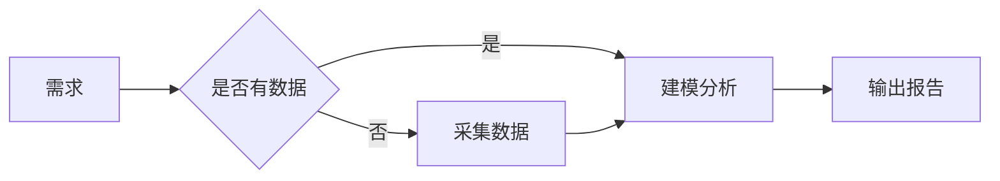

# 你好，这里是 BobHuang 的小站

这是博客的第一篇文章。后续我会把这里当作自己的「公开 Notebook」。

## 我打算写什么

- **算法题解**：把比赛题、LeetCode 经典题做成系列
- **项目复盘**：从墨尺、AiCV、iGEM 抽出工程思考
- **学习笔记**：大模型、大数据、前端的踩坑记
- **生活随笔**：旅行、追星、咖啡日记

## 代码高亮 + 一键复制

```ts
// src/utils/cn.ts
export function cn(...classes: (string | false | undefined)[]) {
  return classes.filter(Boolean).join(' ');
}
```

```python
# Python 也是支持的
def fib(n: int) -> int:
    a, b = 0, 1
    for _ in range(n):
        a, b = b, a + b
    return a
```

## 数学公式（KaTeX）

行内公式：质数定理告诉我们 $\pi(n) \sim \frac{n}{\ln n}$。

块级公式：欧拉恒等式

$$
e^{i\pi} + 1 = 0
$$

线性回归的解析解：

$$
\hat{\boldsymbol{\beta}} = (X^\top X)^{-1} X^\top \boldsymbol{y}
$$

## 流程图（Mermaid）



## 表格 / GFM

| 项目 | 状态 | 备注 |
| --- | --- | --- |
| 博客 Markdown | ✅ | 已支持 |
| 代码高亮 | ✅ | highlight.js |
| TOC 目录 | ✅ | 右侧浮动 |
| 数学公式 | ✅ | KaTeX |
| 流程图 | ✅ | Mermaid |
| 评论 | ⏳ | 需要配置 giscus |

> 留言、互动、纠错，都欢迎～可以通过页面底部的邮箱联系我。
